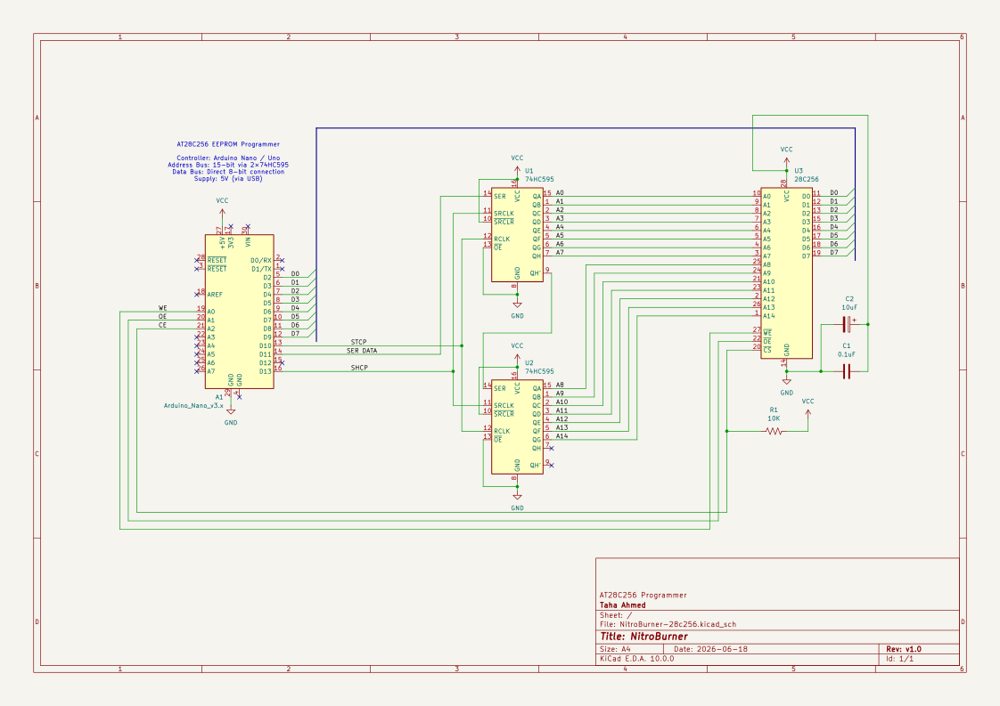
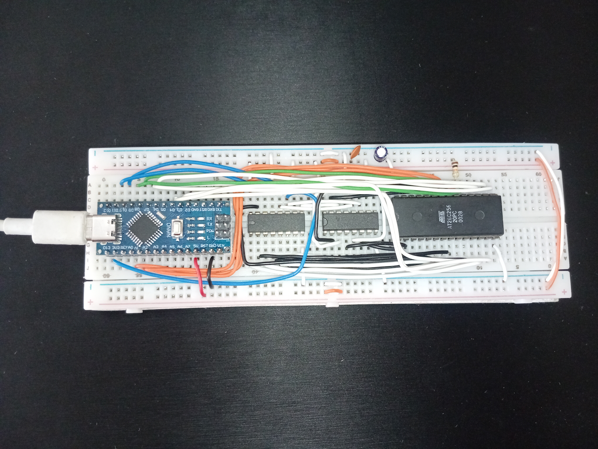
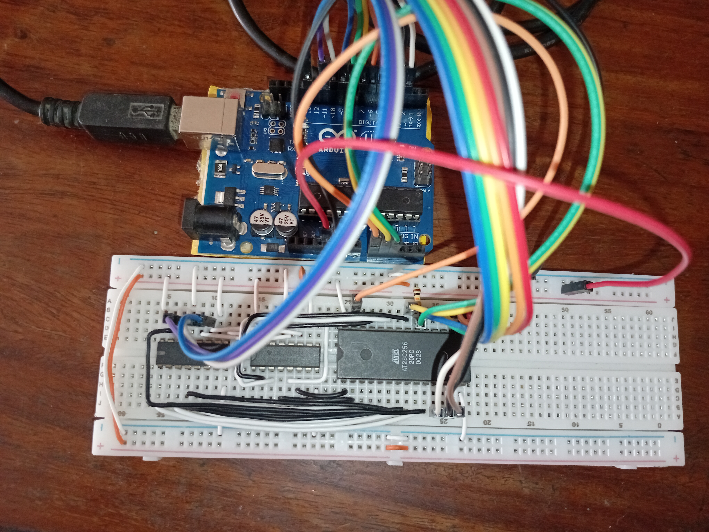

# NitroBurner

A programmer for 28C256 EEPROM using Arduino.  
The firmware is written in C++ using PlatformIO and can be found in `src/main.cpp`.

## Development Environment

- Visual Studio Code
- PlatformIO Extension
- Arduino Framework

## Requirements

- Arduino Uno/Nano
- 74HC595 × 2 Shift Registers
- 28C256 EEPROM

## Features

- A VS Code extension
- Compatible with Arduino Uno and Nano
- Software Data Protection(SDP) lock/unlock support
- Uses Hardware SPI for fast address shifting
- Uses port registers for quick manipulation of data

## Supported Commands

| Command | Description |
| :--- | :--- |
| v | Firmware version |
| r | Read EEPROM |
| R | Raw binary dump |
| w | Write page |
| b | Blank EEPROM |
| d | Disable Software Data Protection |
| e | Enable Software Data Protection |

## Schematic

## Breadbaord Implementation

